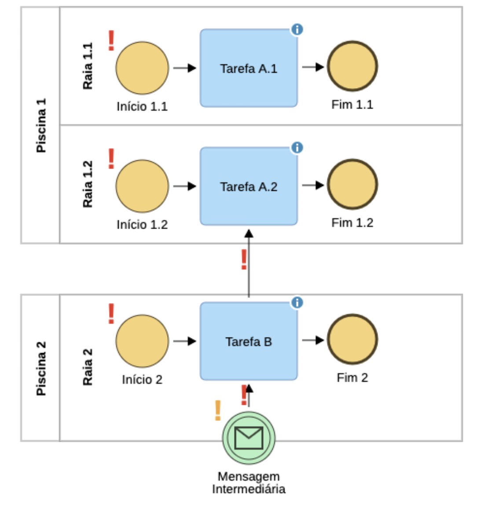

# Adonis

!!! Tip "Version: Adonis Community 11"

!!! Info "Perceived visual elements for problem feedback"
    Icons that locate problems, coloring of the incorrect modeling element, problem list, icons that leads suggestions on how to fix the problem

## Details

Adonis place icons in modeling elements with problems. Icons for errors and warnings have the same shape, but vary in color (red for errors and orange for warnings):

Adonis provide a list with all the problems in the model (in the right side). Each entry in the list has a light bulb icon, and when passing the mouse through it, a suggestion on how to fix the issue is provided:

Besides, when selecting a prolem from the list, Adonis highlights the problem in the model with coloring. Below, an incorrect sequence flow is painted as red and automatically selected by the tool:

