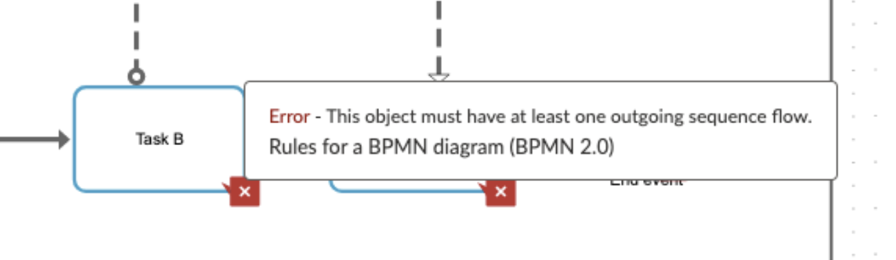
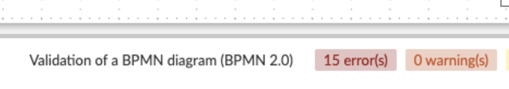

# ARIS

!!! Tip "Version: ARIS Basic 10.0.13.1"

!!! Info "Perceived visual elements for problem feedback"
    Icons locating problems, floating problem explanation

## Details

ARIS places red squares in modeling elements with problems. When hovering the mouse on a square, a floating error explanation is presented:

The tool also display a summary of the number of problems existing in the model, but no complete list was found:

