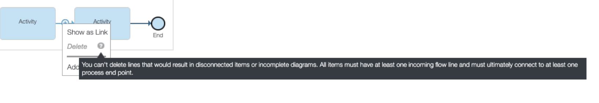

# Blueworks

!!! Tip "Version: IBM Blueworks Live June 2021"

!!! Info "Perceived visual elements for problem feedback"
    Floating explanatory messages

## Details

The tool provides a floating messages explaining why the modeler cannot perform actions that will lead the model to an inconsistent state:

