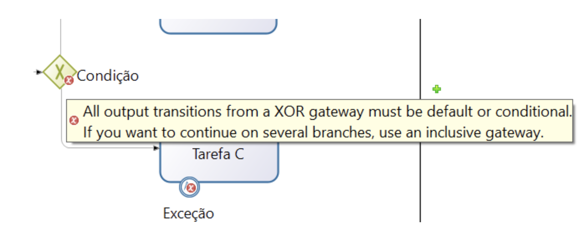
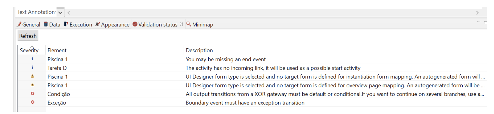

# Bonita

!!! Tip "Version: Bonita BPM Community 7.12.1.1"

!!! Info "Perceived visual elements for problem feedback"
    Icons locating problems, floating problem explanation, problem list

## Details

Bonita highlights problems by placing a red icon. When hovering the mouse on an icon, a floating problem explanation is provided:

The tool also provides a list of all the problems in the model:

