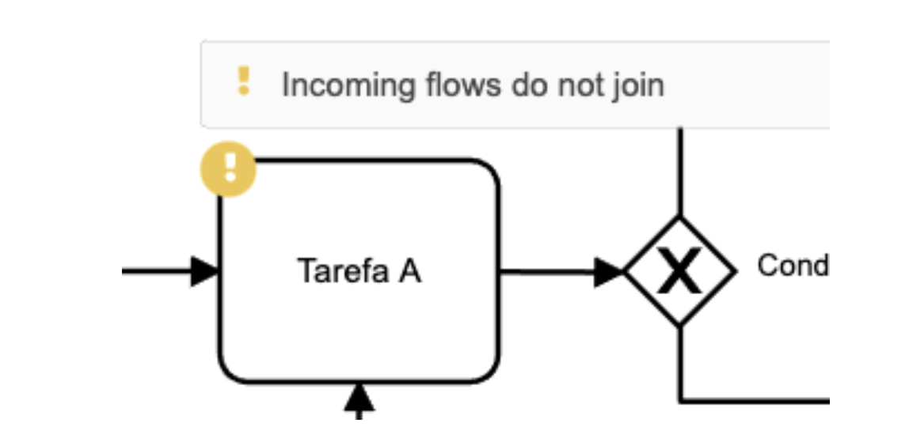
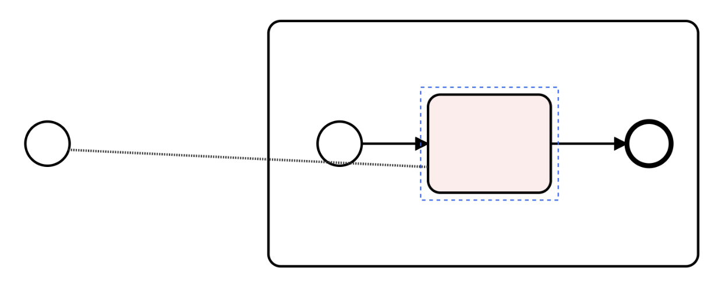

# Camunda

!!! Tip "Version: Camunda Modeler 4.6.0"

!!! Info "Perceived visual elements for problem feedback"
    Icons locating problems, floating problem explanation, coloring

## Details

Camunda identifies problems with colored icons. When hovering the mouse on an icon, a floating problem explanation is provided:

When an invalid action is attempted, Camunda colors the impacted modeling element before canceling the action:

