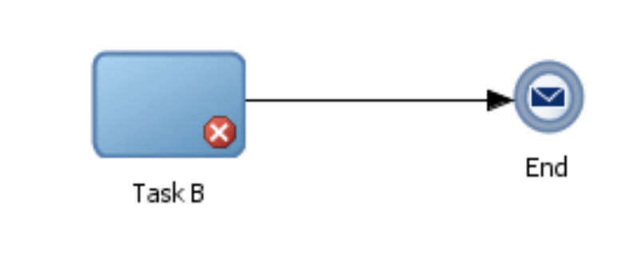
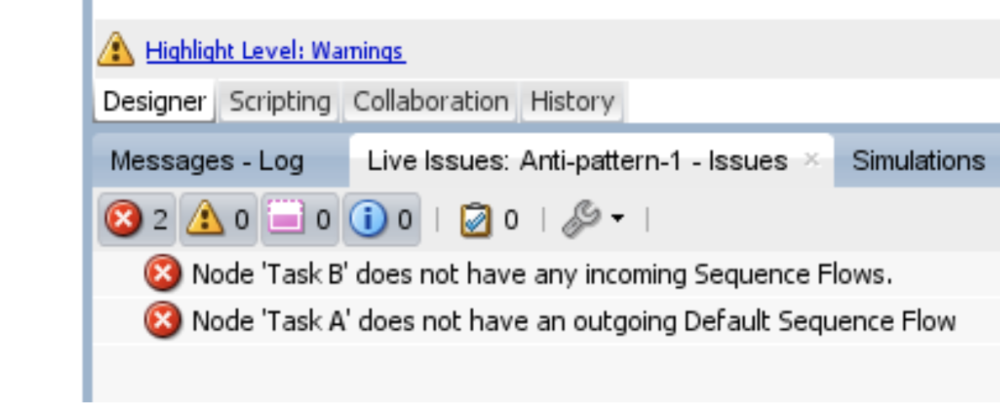

# Oracle BPM

!!! Tip "Version: Oracle BPM Studio 12c"

!!! Info "Perceived visual elements for problem feedback"
    Icons locating problems, floating problem explanation, problem list

## Details

Oracle BPM highlights the problem with an icon. When hovering the mouse on a icon, an explanation is provided (not shown below):

All the problems in the model are shown in a list:

