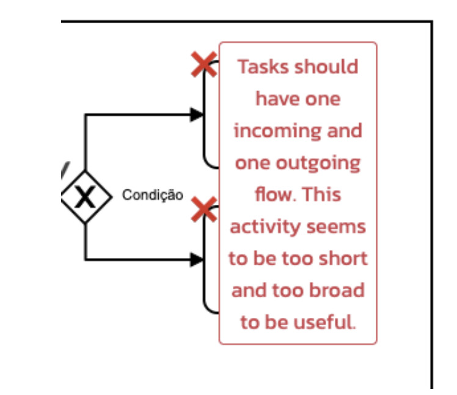
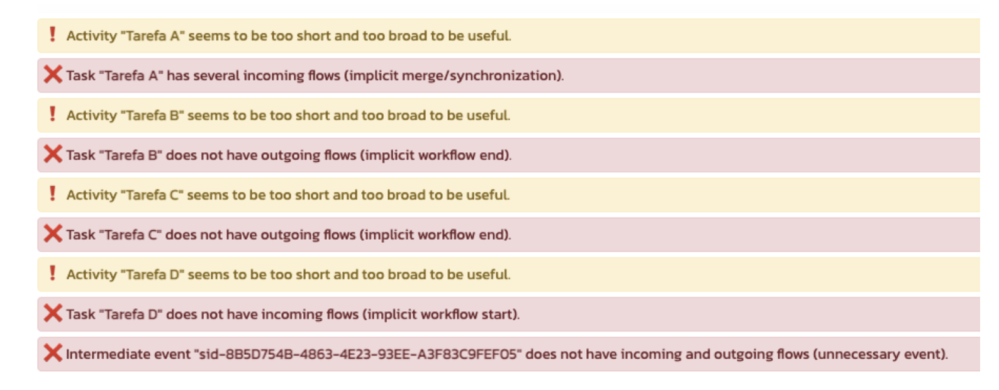

# QualiBPMN

!!! Tip "Version: QualiBPMN from May 15th to May 23rd of 2021"

!!! Info "Perceived visual elements for problem feedback"
    Icons locating problems, floating problem explanation, problem list

## Details

QualiBPMN highlights problems by placing a red icon. When hovering the mouse on an icon, a floating problem explanation is provided:

QualiBPMN also provides a list with all the problems in the model:

