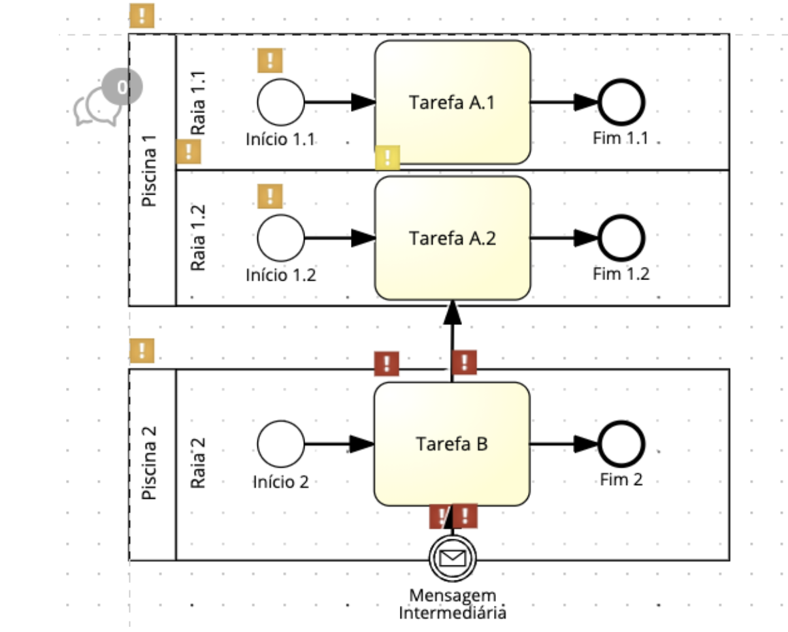
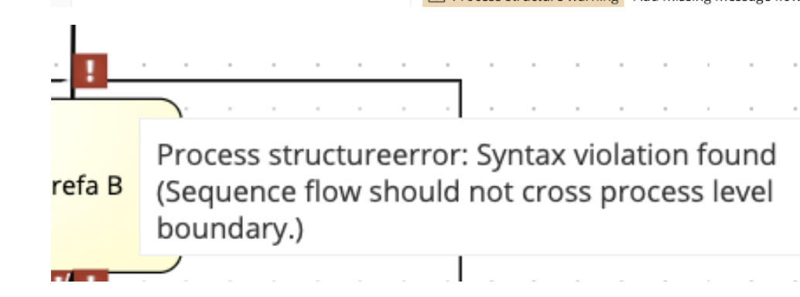
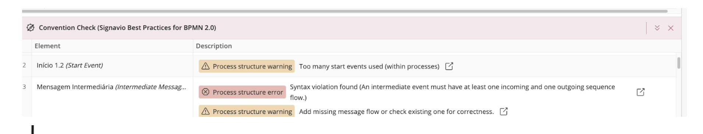
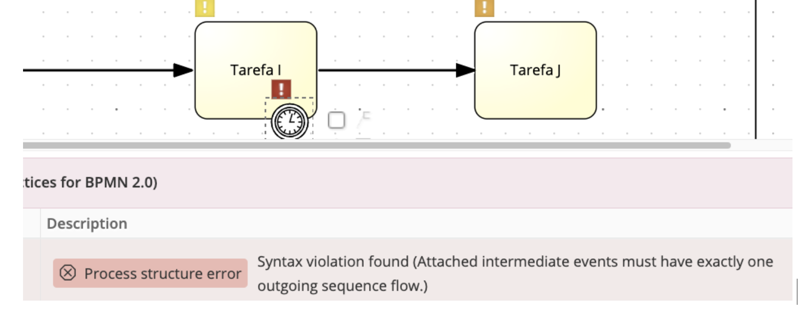

# Signavio

!!! Tip "Version: Signavio Process Manager Academic 14.16.0"

!!! Info "Perceived visual elements for problem feedback"
    Icons that locate problems, problem list, floating problem explanations, icons that leads suggestions on how to fix the problem, highlight of selected problems

## Details

Signavio places square icons to identify problems in the model:

When hovering the mouse on an icon, the tool provides a floating explanation:

Signavio provides a list with all the problems in the model. For each entry in the list, is provided an icon that leads to the problem documentation:

When selecting a problem in the list,, Signavio highlights the problem in the model:

